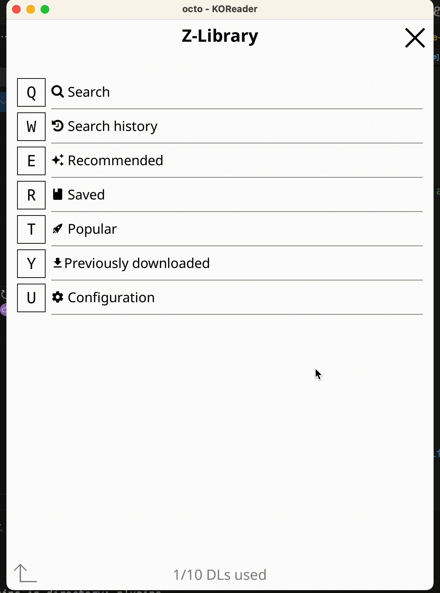

# zlibrary.koplugin

    

KOReader plugin to download books from z-library

## Setting up

1. Download this repo as zip, unpack it into KOReader plugin directory

2. Done! Now you can log into Z-Library from Search section in KOReader

## Development

Create file zl_dev.lua to enable debug logging and automatic zl-version update
